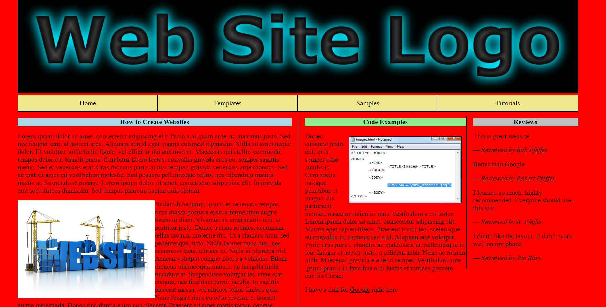
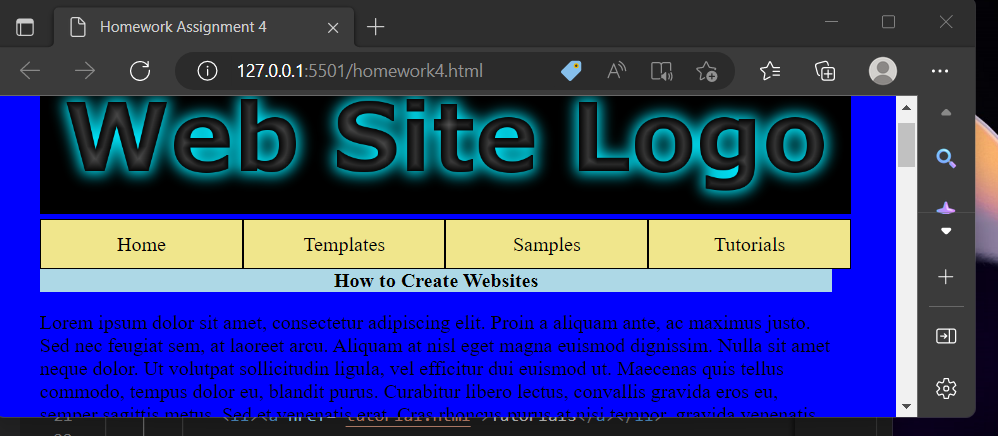

# Responsive-Page
This Project shows the ability of controlling on  elements based on the screens size 

<h1>Responsive Page Using Front-End Languages.</h1>
<ul>
<li>Contains animations when scrolling.</li>
<li>It has three color designs (blue, red and yellow)</li>
<li>Developed first with the Mobile First methodology, then for desktop.</li>
<li>Compatible with all mobile devices .</li>
</ul>

 
 
 

 
 
 

